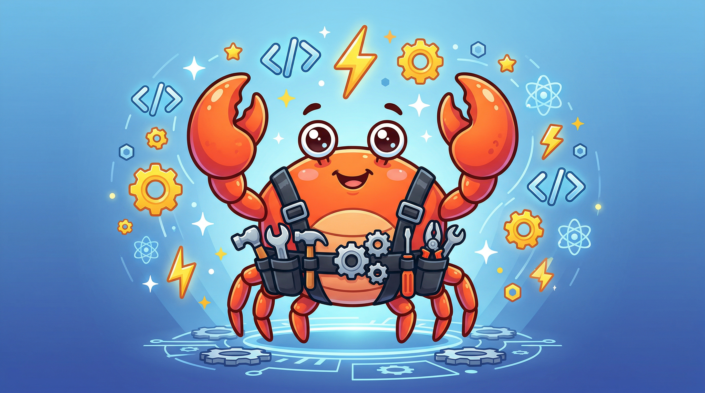

<p align="center">
  
</p>

<p align="center">
  
  <a href="LICENSE"></a>
  
  
</p>

# myharness — Agent Team & Skill Architect for Claude Code

**English** | [한국어](README_KO.md) | [日本語](README_JA.md)

> Say **"build a harness for this project"** or **"하네스 구성해줘"**, and this plugin turns a domain description into an agent team and the skills they use.

> **Fork notice.** This is a personal fork of [revfactory/harness](https://github.com/revfactory/harness) (Apache-2.0). See [`NOTICE`](NOTICE) for attribution and the full list of changes.

## Overview

myharness decomposes complex tasks into coordinated teams of specialized agents. It generates agent definitions (`.claude/agents/`) and skills (`.claude/skills/`) tailored to your domain, then wires them together with an orchestrator skill.

## Installation

```shell
/plugin marketplace add punkyade/myharness
/plugin install myharness@myharness-marketplace
```

Or install the skill directly, without the plugin system:

```shell
cp -r skills/harness ~/.claude/skills/harness
```

## Requirements

- [Agent Teams enabled](https://code.claude.com/docs/en/agent-teams): `CLAUDE_CODE_EXPERIMENTAL_AGENT_TEAMS=1`

Without this flag the team-based execution modes fall back to single-agent execution. See [`docs/experimental-dependency.md`](docs/experimental-dependency.md).

**Optional — multi-runtime mode only:** `codex` and/or `agy` on your `PATH`, authenticated. These are only invoked when you explicitly ask for cross-validation with an external runtime; every other mode works without them, and nothing degrades if they are absent.

## Usage

Trigger it in Claude Code with prompts like:

```
Build a harness for this project
Design an agent team for this domain
하네스 구성해줘
```

Follow-up work is supported by the same skill — "하네스 점검", "에이전트 추가해줘", "하네스 수정해줘" route to the audit and maintenance path rather than rebuilding from scratch.

## Workflow

```
Phase 0: Current-state audit (new build / extend / maintain)
    ↓
Phase 1: Domain analysis
    ↓
Phase 2: Team architecture design (teams / subagents / hybrid / multi-runtime)
    ↓
Phase 3: Agent definition generation (.claude/agents/)
    ↓
Phase 4: Skill generation (.claude/skills/)
    ↓
Phase 5: Integration & orchestration
    ↓
Phase 6: Validation & testing
    ↓
Phase 7: Harness evolution (feedback → revision → change log)
```

### Execution Modes

| Mode | Description | Recommended for |
|------|-------------|-----------------|
| **Agent Teams** (default) | `TeamCreate` + `SendMessage` + `TaskCreate` | 2+ agents that need to coordinate |
| **Subagents** | Direct `Agent` tool invocation | One-off tasks, no inter-agent communication |
| **Hybrid** | Different mode per phase | e.g. parallel collection (sub) → consensus merge (team) |
| **Multi-runtime** (opt-in) | Native team + adapter agents delegating to external CLIs (`codex`, `agy`) read-only | Cross-validation where model diversity matters — only when you ask for it |

### Architecture Patterns

| Pattern | Description |
|---------|-------------|
| Pipeline | Sequential dependent tasks |
| Fan-out/Fan-in | Parallel independent tasks |
| Expert Pool | Context-dependent selective invocation |
| Producer-Reviewer | Generation followed by quality review |
| Supervisor | Central agent with dynamic task distribution |
| Hierarchical Delegation | Top-down recursive delegation |

## Plugin Structure

```
myharness/
├── .claude-plugin/
│   ├── plugin.json                     # Plugin manifest
│   └── marketplace.json                # Marketplace manifest
├── skills/
│   └── harness/
│       ├── SKILL.md                    # Main skill definition (Phase 0–7)
│       ├── references/
│       │   ├── agent-design-patterns.md   # 6 architectural patterns
│       │   ├── orchestrator-template.md   # Orchestrator templates (A–D)
│       │   ├── team-examples.md           # 5 real-world team configurations
│       │   ├── skill-writing-guide.md     # Skill authoring guide
│       │   ├── skill-testing-guide.md     # Testing & evaluation methodology
│       │   ├── qa-agent-guide.md          # QA agent integration guide
│       │   └── multi-runtime-guide.md     # External CLI integration (codex, agy)
│       └── scripts/
│           └── delegate.py             # External runtime delegation
└── docs/
    ├── quickstart.md
    └── experimental-dependency.md
```

## Output

Files generated into your target project:

```
your-project/
├── CLAUDE.md            # Harness pointer (trigger rule + change log)
└── .claude/
    ├── agents/          # Agent definition files
    │   ├── analyst.md
    │   ├── builder.md
    │   └── qa.md
    └── skills/          # Skill files
        ├── analyze/
        │   └── SKILL.md
        └── build/
            ├── SKILL.md
            └── references/
```

## Example Prompts

```
Build a harness for deep research. I need an agent team that can investigate
any topic from multiple angles — web search, academic sources, community
sentiment — then cross-validate findings and produce a comprehensive report.
```

```
Build a harness for full-stack website development. The team should handle
design, frontend (React/Next.js), backend (API), and QA testing in a
coordinated pipeline from wireframe to deployment.
```

```
Build a harness for comprehensive code review. I want parallel agents
checking architecture, security vulnerabilities, performance bottlenecks,
and code style — then merging all findings into a single report.
```

## License

Apache 2.0 — see [`LICENSE`](LICENSE) and [`NOTICE`](NOTICE).
